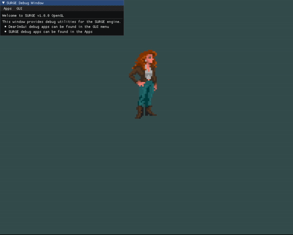

 SURGE: Super UnderRated Game Engine

 A prototype game engine made for fun (and profit ?).

# Demos

## 2048


## Character motion


# Build instructions

1. Install `git` and `cmake`
2. Clone the repository: `git clone https://github.com/lucass-carneiro/SURGE`
3. Initialize submodules: `git submodule init`
4. Update submodules: `git submodule update`
5. Choose your build parameters and configuration

| Build types | [Build argument] |
|:-----------:|:----------------:|
|   Release   |      Release     |
|    Debug    |       Debug      |

| Argument                           | Effect                                                     | Possible values | Default value            |
|------------------------------------|------------------------------------------------------------|-----------------|--------------------------|
| -DCMAKE_EXPORT_COMPILE_COMMANDS=ON | Exports `compile_commands.json` file for usage in IDEs.    | OFF/ON          | OFF                      |
| -DSURGE_OPENGL_ERROR_BUFFER_SIZE   | Size of the static buffer used to capture OpenGL messages  | >=1024          | 1024                     |
| -DSURGE_OPENGL_ERROR_BUFFER_SIZE   | Number of samples in the FPS counter (2)                   | Integer         | 1024                     |
| -DSURGE_USE_LOG                    | Enable log messages.                                       | OFF/ON          | ON                       |
| -DSURGE_USE_LOG_COLOR              | Use colors on log outputs.                                 | OFF/ON          | ON                       |
| -DSURGE_STBIMAGE_ERRORS            | Enables more verbose error message strings in stb_image.   | OFF/ON          | ON                       |
| -DSURGE_ENABLE_SANITIZERS          | Compiles code with sanitizers.                             | OFF/ON          | ON (Debug), OFF(Release) |
| -DSURGE_ENABLE_OPTIMIZATIONS       | Compiles code with optimizations.                          | OFF/ON          | OFF (Debug), ON(Release) |
| -DSURGE_ENABLE_LTO                 | Compiles code with link time optimizations (-O2).          | OFF/ON          | OFF (Debug), ON(Release) |
| -DSURGE_ENABLE_FAST_MATH           | Compiles code with fast math mode.                         | OFF/ON          | OFF (Debug), ON(Release) |
| -DSURGE_ENABLE_TUNING              | Compiles code with architecture tuning.                    | OFF/ON          | OFF (Debug), ON(Release) |
| -DSURGE_DEBUG_MEMORY               | Enable custom allocators debug facilities.                 | OFF/ON          | ON (Debug), OFF(Release) |
| -DSURGE_ENABLE_THREADS             | Enables multithreading.                                    | OFF/ON          | ON                       |

6. Install dependencies and create build system:
`cmake -B [Build argument] -S . -DCMAKE_BUILD_TYPE=[Build argument] [Other arguments]`

7. Build: `cmake --build [Build argument]`

## Example Debug build

Example for building a Debug build with compiler commands exporting using clang:

```
git clone https://github.com/lucass-carneiro/SURGE && cd SURGE
git submodule init
git submodule update
cmake -B Debug -S . -DVCPKG_TARGET_TRIPLET=x64-linux -DCMAKE_CXX_COMPILER=clang++ -DCMAKE_BUILD_TYPE=Debug -DCMAKE_EXPORT_COMPILE_COMMANDS=ON
cmake --build Debug -j20
```

On Windows, use,
```
cmake -B Debug -S . -DVCPKG_TARGET_TRIPLET=x64-windows-static -DCMAKE_BUILD_TYPE=Debug -DCMAKE_EXPORT_COMPILE_COMMANDS=ON
```
on the 4th step.

# References
https://www.lua.org/manual/5.3/manual.html
https://registry.khronos.org/OpenGL-Refpages/gl4/
https://www.khronos.org/opengl/wiki/Vertex_Specification_Best_Practices
https://learnopengl.com/
https://stackoverflow.com/a/39684775
https://pbrfrat.com/post/imgui_in_browser.html
https://github.com/wolfpld/tracy