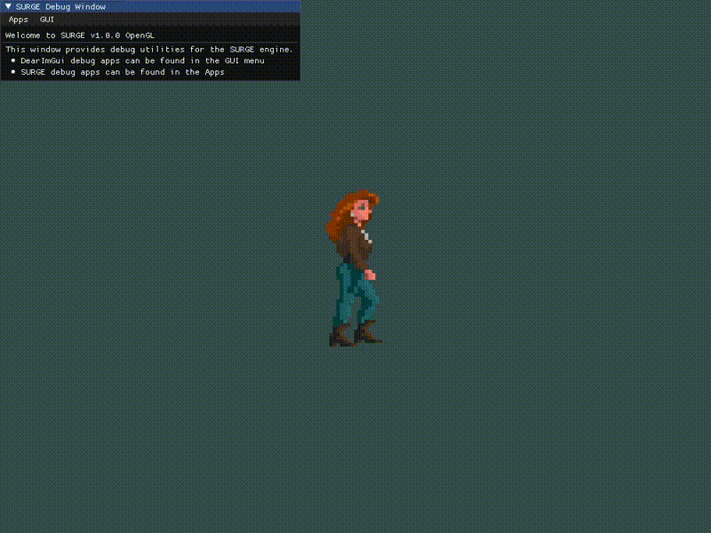

 SURGE: Super UnderRated Game Engine

 A prototype game engine made for fun (and profit ?).

# Demo



# Build instructions

1. Install `git` and `cmake`
2. Clone the repository: `git clone https://github.com/lucass-carneiro/SURGE`
3. Initialize submodules: `git submodule init`
4. Update submodules: `git submodule update`
5. Choose your build parameters and configuration

| Build types | [Build argument] |
|:-----------:|:----------------:|
|   Release   |      Release     |
|    Debug    |       Debug      |

| Argument                           | Effect                                                     | Possible values | Default value            |
|------------------------------------|------------------------------------------------------------|-----------------|--------------------------|
| -DCMAKE_EXPORT_COMPILE_COMMANDS=ON | Exports `compile_commands.json` file for usage in IDEs.    | OFF/ON          | OFF                      |
| -DSURGE_OPENGL_ERROR_BUFFER_SIZE   | Size of the static buffer used to capture OpenGL messages  | >=1024          | 1024                     |
| -DSURGE_OPENGL_ERROR_BUFFER_SIZE   | Number of samples in the FPS counter (2)                   | Integer         | 1024                     |
| -DSURGE_USE_LOG                    | Enable log messages.                                       | OFF/ON          | ON                       |
| -DSURGE_USE_LOG_COLOR              | Use colors on log outputs.                                 | OFF/ON          | ON                       |
| -DSURGE_STBIMAGE_ERRORS            | Enables more verbose error message strings in stb_image.   | OFF/ON          | ON                       |
| -DSURGE_ENABLE_SANITIZERS          | Compiles code with sanitizers.                             | OFF/ON          | ON (Debug), OFF(Release) |
| -DSURGE_ENABLE_OPTIMIZATIONS       | Compiles code with optimizations.                          | OFF/ON          | OFF (Debug), ON(Release) |
| -DSURGE_ENABLE_LTO                 | Compiles code with link time optimizations (-O2).          | OFF/ON          | OFF (Debug), ON(Release) |
| -DSURGE_ENABLE_FAST_MATH           | Compiles code with fast math mode.                         | OFF/ON          | OFF (Debug), ON(Release) |
| -DSURGE_ENABLE_TUNING              | Compiles code with architecture tuning.                    | OFF/ON          | OFF (Debug), ON(Release) |
| -DSURGE_DEBUG_MEMORY               | Enable custom allocators debug facilities.                 | OFF/ON          | ON (Debug), OFF(Release) |
| -DSURGE_ENABLE_THREADS             | Enables multithreading.                                    | OFF/ON          | ON                       |

6. Install dependencies and create build system:
`cmake -B [Build argument] -S . -DCMAKE_BUILD_TYPE=[Build argument] [Other arguments]`

7. Build: `cmake --build [Build argument]`

## Example Debug build

Example for building a Debug build with compiler commands exporting using clang:

```
git clone https://github.com/lucass-carneiro/SURGE && cd SURGE
git submodule init
git submodule update
cmake -B Debug -S . -DVCPKG_TARGET_TRIPLET=x64-linux -DCMAKE_CXX_COMPILER=clang++ -DCMAKE_BUILD_TYPE=Debug -DCMAKE_EXPORT_COMPILE_COMMANDS=ON
cmake --build Debug -j20
```

# Tasks

## GUI TODO
* [ ] Integrate tracy profiler
* [ ] Create animation debugger

## GUI Done
* [x] Implement FPS counter
* [x] ~Implement memory visualizer~

## Character movement with arrows demo
* [ ] Handle multiple input more gracefully
* [x] Sometimes, the horizontal animation flips get inverted. Why?

##  Main TODO
* [ ] Finish state changes demo
* [ ] Fix paths in scripts
* [ ] Add show/hide to debug windows triggered by customized key
* [ ] Investigate why hidden cursors are not working
* [ ] Add VM hooks for joysticks?
* [ ] Make shaders read SPIRV files (available in OpenGL 4.6)
* [ ] Find out safer way to provide VM index from the lua state.
* [ ] Add parallel task synchronization. Review parallel task system?
* [ ] Color lookup for animations [see here](https://www.youtube.com/watch?v=HsOKwUwL1bE)
* [ ] Make `actor` entity use `animated_sprite` entity (compose objects)

## Main Done
* [x] Review file loading to memory functions. Implement: load to buffer, ~load given allocator~
* [x] Implement do_file_at with more granularity
* [x] Implement safety net in lua_log_message with try catch.
* [x] Implement more log functions.
* [x] Find out the VM index from the lua state.
* [x] Review image loader
* [x] Create stack-backed static allocator.
* [x] Allow stack allocator to free out of order using the stack backed allocator.
* [x] Add VM hooks to load and drop images.
* [x] Review opengl buffer arrays
* [x] Load shaders in vm.
* [x] Add vm hooks for shaders: Compiling and using
* [x] Add static mesh drawing
* [x] Add texture to static mesh
* [x] Remake the static mesh as a single drawable sprite.
* [x] Remove global opengl buffers.
* [x] Create sprite shader.
* [x] Add sprite drawing to script.
* [x] Commit to a 2D renderer?.
* [x] Use sprite shader to shade all sprites. 
* [x] Animate sprites via scripts
* [x] Add script hooks for keyboard input
* [x] Thread allocators are not getting destroyed. Investigate.
* [x] Add VM hooks for parallel job system
* [x] Add script hooks for mouse input
* [x] Handle sprite sets with many sprite sheets of different properties
* [x] Finish background test demo
* [x] Add a function to reset quad geometry
* [x] Add a general sprite compiler
* [x] Read animation from .sad files
* [x] Add actor interface/abstraction in the engine
* [x] Add animation playing in actor abstraction
* [x] Add texture flipping.
* [x] Anchor point relative motion
* [x] Track actor heading.
* [x] Review allocator system.
* [x] Finish character animation with arrow movement demo
* [x] Fix hot reloading
* [x] Review Sprite API exposed to Lua


# References
https://www.lua.org/manual/5.3/manual.html
https://registry.khronos.org/OpenGL-Refpages/gl4/
https://www.khronos.org/opengl/wiki/Vertex_Specification_Best_Practices
https://learnopengl.com/
https://stackoverflow.com/a/39684775
https://pbrfrat.com/post/imgui_in_browser.html
https://github.com/wolfpld/tracy