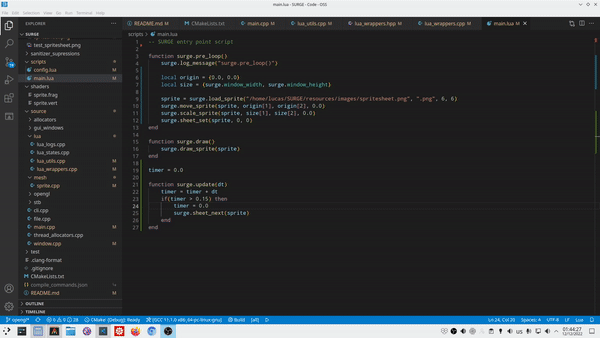

 SURGE: Super UnderRated Game Engine

 A prototype game engine made for fun.

# Demo



# Build & run instructions

```
cd Debug

conan install ../conan --remote=conancenter --build missing --profile ../conan/toolchain-gcc-12-release
cmake .. -G "Unix Makefiles" -DCMAKE_EXPORT_COMPILE_COMMANDS=ON -DCMAKE_BUILD_TYPE=Debug
cmake --build . -j20
./run
```

# Tasks

## GUI TODO
* [ ] Integrate tracy profiler

## GUI Done
* [x] Implement FPS counter
* [x] Implement memory visualizer

##  Main TODO
* [ ] Add script hooks for mouse input
* [ ] Make shaders read SPIRV files (available in OpenGL 4.6)
* [ ] Thread allocators are not getting destroyed. Investigate.
* [ ] Find out safer way to provide VM index from the lua state.

## Main Done
* [x] Review file loading to memory functions. Implement: load to buffer, ~load given allocator~
* [x] Implement do_file_at with more granularity
* [x] Implement safety net in lua_log_message with try catch.
* [x] Implement more log functions.
* [x] Find out the VM index from the lua state.
* [x] Review image loader
* [x] Create stack-backed static allocator.
* [x] Allow stack allocator to free out of order using the stack backed allocator.
* [x] Add VM hooks to load and drop images.
* [x] Review opengl buffer arrays
* [x] Load shaders in vm.
* [x] Add vm hooks for shaders: Compiling and using
* [x] Add static mesh drawing
* [x] Add texture to static mesh
* [x] Remake the static mesh as a single drawable sprite.
* [x] Remove global opengl buffers.
* [x] Create sprite shader.
* [x] Add sprite drawing to script.
* [x] Commit to a 2D renderer?.
* [x] Use sprite shader to shade all sprites. 
* [x] Animate sprites via scripts
* [x] Add script hooks for keyboard input

# References
https://www.lua.org/manual/5.3/manual.html
https://registry.khronos.org/OpenGL-Refpages/gl4/
https://www.khronos.org/opengl/wiki/Vertex_Specification_Best_Practices
https://learnopengl.com/
https://stackoverflow.com/a/39684775
https://pbrfrat.com/post/imgui_in_browser.html
https://github.com/wolfpld/tracy